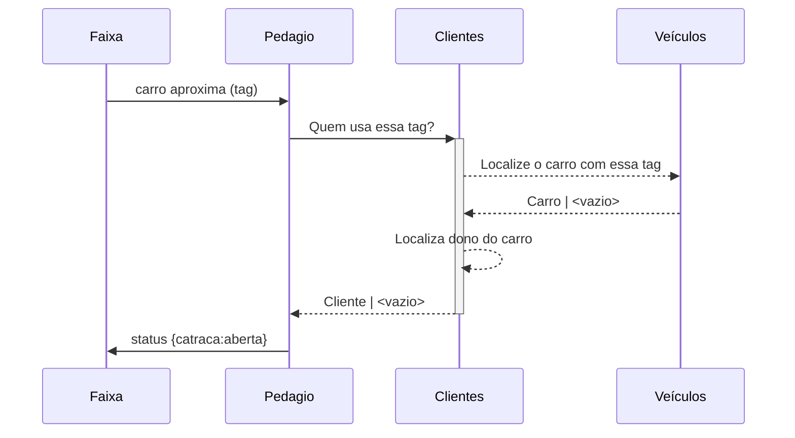

# Carro se aproxima e Pedágio decide se libera passagem

Revisão: 2023-09-29

Diagrama

# Descrição

O simulador de tráfego enviará requisições para sinalizar que um carro se aproximou do pedágio e aguarda um status de abertura da cancela.

# Requerimentos técnicos

- requisição http ou grpc para o serviço do pedágio
  - envia: tag do carro
  - aguarda: status de abertura da cancela
